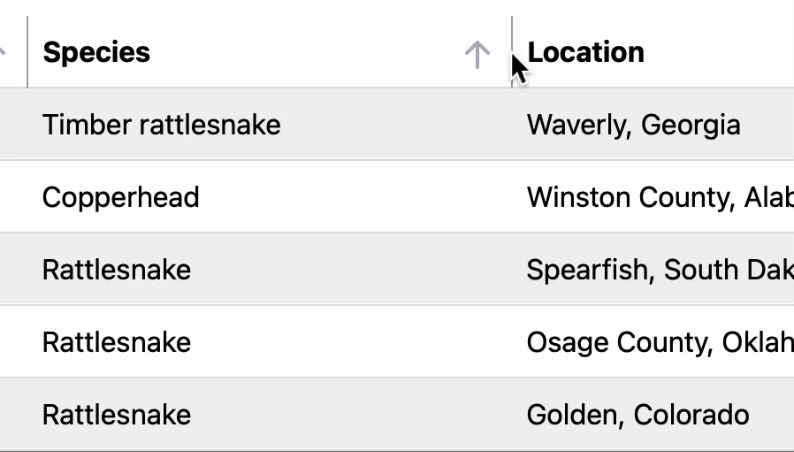
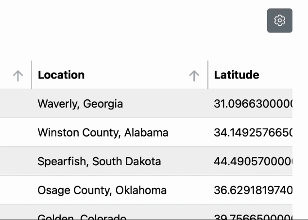
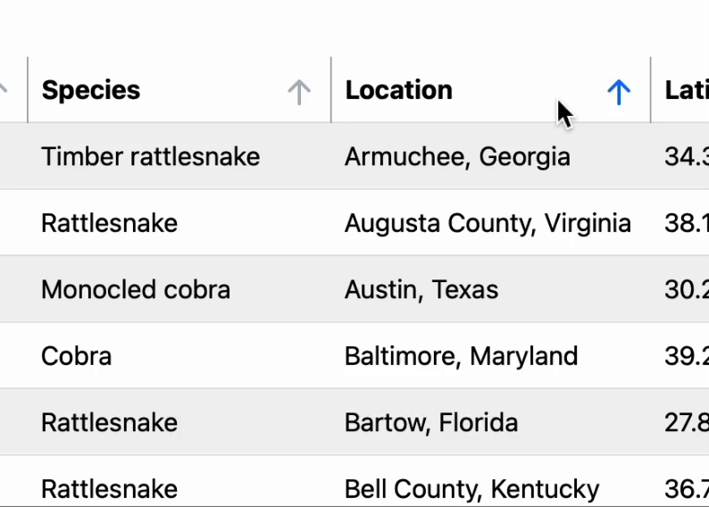
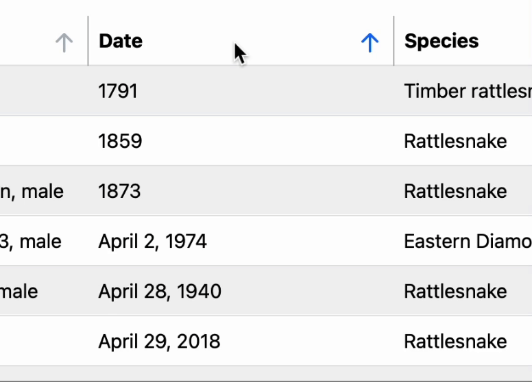

<!-- material/tags { toc: false } -->

# Overview

## What is Krait?
Krait is a robust Laravel package that streamlines the generation of Ajax Dynamic DataTables.
Developed as a combination of VueJS components and PHP functionalities, it automates the development of front-end and back-end resources via simple CLI commands.
The package is capable of generating a comprehensive set of controllers, routes, Vue components, and table definitions with a single command:

```sh
php artisan krait:table MyAwesomeTable
```

All the Resource Linking happens behind the scenes for you and you should think about the data processing and representation **only**.

## Features

### Front-End Dynamic Tables
All front-end tables include the following features out of the box:

#### Resizable columns
All columns in the front-end are resizable by default. To make a column fixed, you should explicitly flag it
as fixed in the [Table Definition Class](./core-components/#table-classes).

{: style="height:248px;display: block;margin-left: auto;margin-right: auto;float: right;padding: 0 20px"}
```php title="YourTable.php" hl_lines="7"
<?php
    ...
    function initColumns() {
        $this->column(
            name: 'some_fixe_column',
            label: 'Some Fixed Column',
            fixed: true,
        )
    }
    ...
```

#### Visible Columns Selection
All columns are visible by default but the user can manually hide some of them using a dropdown.
{: style="height:275px;display: block;margin-left: auto;margin-right: auto;"}

#### Columns Reordering
The user can manually adjust the order of the table columns.
The order will be saved in the database and reused.

{: style="height:275px;display: block;margin-left: auto;margin-right: auto;"}


#### AJAX Pagination Fetching
All table-related actions are Ajax-based so the end-user table operations are faster without the need of page reloading.
The `Items Per Page` setting is adjustable via dropdown.

#### Columns Sorting
All columns in the front-end are sortable by default. To make a column not sortable, you should explicitly flag it
as `sortable: false` in the [Table Definition Class](./core-components/#table-classes).

{: style="height:248px;display: block;margin-left: auto;margin-right: auto;float: right;padding: 0 20px"}
```php title="YourTable.php" hl_lines="7"
<?php
    ...
    function initColumns() {
        $this->column(
            name: 'some_fixe_column',
            label: 'Some Fixed Column',
            sortable: false,
        )
    }
    ...
```

#### Per-user Preview Configurations
Krait saves all user preview preferences in the database. Whenever a user hides/resizes/reorders columns,
the updates are saved and reused the next time that user opens the table.

## When Should I Use Krait?

Two factors should be taken into account when answering this question:

- The package handles the creation of all resources and their linking out-of-the-box.
    * that helps you focus on the more important parts (defining processing data callbacks, fetching records, etc.)
    * that provides you with already-tested back-end functionality 
- The front-end uses VueJS components so the data is represented in an async (Ajax) way.
    * as all filtering, sorting, and pagination processes use Ajax, the whole table gets faster
    * that helps you to develop more dynamic table content

The package is suitable for:

* Projects that serve massive datasets to the end-users
* Projects that contain complex tables
    * with more dynamic front-end elements
    * with complex callbacks for pre-processing the shown data
